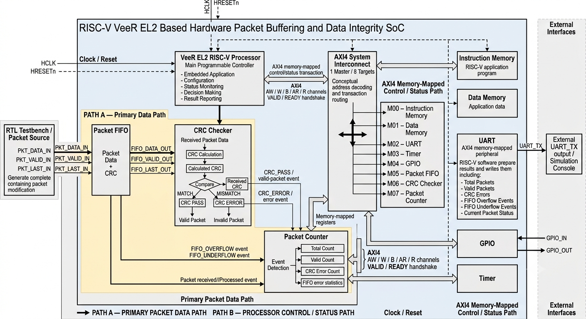

# Honours Lab 316

> **Digital VLSI • RTL Design • SoC • Hardware IP • FPGA**

This repository contains the **Digital VLSI, RTL, SoC, FPGA, and hardware IP development work** carried out as part of **Honours Lab**.

The repository brings together the current **Honours Project on Packet Buffering** along with additional hardware IP and RTL projects developed during the lab, including **I2C, AXI-Lite UART, and AES**.

The primary technical focus of the work is on **digital hardware design, synthesizable RTL, reusable IP development, SoC interfaces, verification, and FPGA-oriented implementation**.

---

## 📌 Current Project — RISC-V Veer EL2 Based Hardware Packet Buffering and Data Integrity SoC

### Overview

The primary ongoing work in this repository is the development of a **RISC-V Veer EL2 based hardware Packet Buffering and Data Integrity SoC**.

The system combines a **RISC-V processor, AXI4 system interconnect, packet buffering, CRC-based data integrity checking, packet/event monitoring, and memory-mapped peripherals** into a single SoC-oriented hardware architecture.



The architecture is divided into two major paths:

- **Path A — Primary Packet Data Path**
- **Path B — Processor Control / Status Path**

This separation allows the packet data to flow through dedicated hardware datapath logic while the RISC-V processor is responsible for configuration, monitoring, control, and reading system status.

---

### 🔹 Path A — Primary Packet Data Path

The primary packet data path handles the actual packet flow through the hardware.

```text
RTL Testbench / Packet Source
            │
            ▼
       Packet FIFO
            │
            ▼
       CRC Checker
            │
       ┌────┴────┐
       │         │
    CRC PASS   CRC ERROR
       │         │
       └────┬────┘
            ▼
      Packet Counter
```

## ➤ Packet Buffering Objectives

The current project focuses on:

- Designing a synthesizable packet buffering architecture.
- Temporarily storing incoming packets.
- Managing packet write and read operations.
- Handling buffer availability.
- Handling full and empty conditions.
- Maintaining packet ordering.
- Preventing invalid reads and unwanted overwrites.
- Supporting controlled packet forwarding.
- Implementing appropriate flow-control mechanisms.
- Handling continuous and burst packet traffic.
- Maintaining data integrity.
- Developing a verification environment.
- Performing synthesis and hardware-resource analysis.
- Preparing the design for FPGA-oriented implementation.

---

## ➤ Packet Buffer Operation

The basic operation can be represented as:

```text
        Producer
           │
           │ Packet Data
           ▼
    ┌───────────────┐
    │ Input / Write │
    │    Control    │
    └───────┬───────┘
            │
            ▼
    ┌─────────────────────┐
    │                     │
    │    Packet Buffer    │
    │                     │
    │ ┌─────────────────┐ │
    │ │ Packet Storage  │ │
    │ └─────────────────┘ │
    │                     │
    │ Buffer Management   │
    │ Read / Write Ctrl   │
    │ Occupancy / Status  │
    │                     │
    └──────────┬──────────┘
               │
               ▼
       ┌──────────────┐
       │ Output / Read│
       │    Control   │
       └──────┬───────┘
              │
              │ Packet Data
              ▼
          Consumer
```

### 1. Packet Arrival

A packet arrives from the input or producer interface.

The input-side control logic determines whether the buffer is capable of accepting the incoming data.

### 2. Packet Storage

When storage is available, the packet is written into the buffer.

The write-side logic manages where the incoming packet/data should be stored.

### 3. Buffer Management

The buffer control logic keeps track of the current state of the storage.

Important conditions include:

- Empty
- Partially occupied
- Full
- Valid write
- Valid read
- Available storage
- Available data
- Simultaneous read/write
- Flow-control conditions

### 4. Packet Forwarding

When the downstream module is ready, stored packet data is read from the buffer and forwarded to the consumer.

This allows the producer and consumer to operate without requiring identical processing rates.

---

## ➤ Flow Control

Flow control is an important aspect of packet buffering.

A conceptual valid/ready-style interface can be represented as:

```text
    Producer                         Buffer / Consumer
       │                                    │
       │ ------------- VALID -------------> │
       │                                    │
       │ <------------ READY -------------- │
       │                                    │
       │           DATA TRANSFER            │
       │                                    │
```

The buffering logic must ensure that:

- Data is accepted only when storage is available.
- Valid data is not overwritten.
- Data is not read when the buffer is empty.
- Backpressure can be handled where required.
- Packet ordering is maintained.
- Valid packet data is forwarded correctly.

---

## ➤ Buffer Conditions

### Empty Condition

When the buffer contains no valid packet/data:

```text
┌──────────────────────┐
│    PACKET BUFFER     │
│                      │
│        EMPTY         │
│                      │
└──────────────────────┘
```

A read operation must not result in invalid packet transfer.

### Full Condition

When the buffer has no remaining storage:

```text
┌──────────────────────┐
│    PACKET BUFFER     │
│──────────────────────│
│      Packet 0        │
│      Packet 1        │
│      Packet 2        │
│       ...            │
│      Packet N        │
│                      │
│        FULL          │
└──────────────────────┘
```

The design must prevent new writes from corrupting already stored data.

---

## ➤ Packet Buffer Verification

Verification is an important part of the project.

The verification effort is intended to cover:

- Reset behavior
- Packet write operation
- Packet read operation
- Empty-buffer behavior
- Full-buffer behavior
- Continuous packet transfers
- Back-to-back packets
- Simultaneous read/write operations
- Flow-control behavior
- Packet ordering
- Data integrity
- Boundary conditions
- Corner cases

A general verification flow is:

```text
                 ┌─────────────────┐
                 │   Packet Buffer │
                 │       RTL       │
                 └────────┬────────┘
                          │
                          ▼
                 ┌─────────────────┐
                 │    Testbench    │
                 └────────┬────────┘
                          │
              ┌───────────┼───────────┐
              │           │           │
              ▼           ▼           ▼
          Stimulus     Monitor     Checker
              │           │           │
              └───────────┼───────────┘
                          │
                          ▼
                  Expected vs Actual
                          │
                          ▼
                       PASS/FAIL
```

The verification environment will be expanded as the RTL architecture is finalized.

---

# 🔌 Additional Hardware IPs and Projects

The repository also contains additional hardware-development work completed as part of Honours Lab.

---

## 1. I2C Hardware IP

### Overview

The repository contains an **I2C hardware IP** developed for digital serial communication with I2C-compatible peripherals.

The project focuses on understanding and implementing the digital logic required for an I2C communication interface.

### Development Areas

- I2C protocol
- RTL design
- Control logic
- Serial data transfer
- Clock/control generation
- SDA/SCL interface
- Peripheral communication
- Simulation and verification
- Reusable hardware IP development

### Repository Location

```text
Honours_lab_316/
└── I2C/
```

The I2C project is maintained independently within its dedicated directory.

---

# 2. AXI-Lite UART IP Core

### Overview

The repository contains an **AXI4-Lite based UART IP core** developed as a reusable SoC peripheral.

The project combines a standard **AXI4-Lite memory-mapped interface** with UART transmit and receive functionality.

At a high level:

```text
                 AXI4-Lite
                     │
                     ▼
           ┌───────────────────┐
           │ AXI-Lite Slave    │
           │    Interface      │
           └─────────┬─────────┘
                     │
                     ▼
           ┌───────────────────┐
           │  UART Registers   │
           └─────────┬─────────┘
                     │
                     ▼
           ┌───────────────────┐
           │   UART Control    │
           └─────────┬─────────┘
                     │
                ┌────┴────┐
                ▼         ▼
             UART TX   UART RX
```

### Main Areas

- AXI4-Lite slave interface
- Memory-mapped registers
- UART transmitter
- UART receiver
- Baud-rate related logic
- Control and status registers
- RTL simulation
- IP development
- SoC peripheral integration

### Repository Location

```text
Honours_lab_316/
└── axi-lite_uart-ipcore/
    ├── documentation/
    ├── scripts/
    ├── src/
    ├── LICENSE
    ├── Makefile
    ├── README.md
    └── project.config
```

The project is organized as a reusable IP-oriented hardware project with source code, documentation, scripts, and build/project configuration.

---

# 3. AES Hardware Core

### Overview

An **AES hardware encryption core** is also included in the repository.

The project provides practical experience in implementing a cryptographic hardware core and integrating it with an AXI-based interface.

At a high level:

```text
                  AXI Interface
                       │
                       ▼
              ┌─────────────────┐
              │   AES Registers │
              └────────┬────────┘
                       │
                       ▼
              ┌─────────────────┐
              │   AES Control   │
              └────────┬────────┘
                       │
                       ▼
              ┌─────────────────┐
              │    AES Core     │
              │                 │
              │  Round Logic    │
              │  S-Box          │
              │  Key Expansion  │
              │                 │
              └────────┬────────┘
                       │
                       ▼
                   Ciphertext
```

### Main Components

- AES encryption core
- AES key expansion
- AES S-Box
- AES register set
- AXI interface
- RTL testbench
- Simulation environment
- Supporting data
- Synthesis-related files

### Repository Structure

```text
Honours_lab_316/
└── aes_core-master/
    ├── bench/verilog/
    ├── data/
    ├── doc/
    ├── rtl/verilog/
    ├── sim/rtl_sim/
    ├── syn/bin/
    ├── aes_core.core
    ├── novas.rc
    └── vim_session.vim
```

The project includes separate RTL, testbench, simulation, documentation, and synthesis-related directories.

---

## ➤ RISC-V Processor — VeeR EL2

### Open-Source Processor Integration

The current SoC project integrates the **VeeR EL2 RISC-V processor**, an **open-source RISC-V processor core** from the CHIPS Alliance.

The processor is not designed from scratch as part of this project. Instead, the **open-source VeeR EL2 core is integrated into the custom SoC architecture** and connected with the project's hardware IPs through the **AXI4 system interconnect**.

This allows the project to focus on **SoC architecture, hardware IP integration, packet buffering, data integrity, and RTL-based hardware design** while using an established open-source processor as the programmable processing element.

### Role of VeeR EL2 in the SoC

The VeeR EL2 processor acts as the **main programmable controller** of the system. It communicates with the memory and peripherals through the AXI4-based memory-mapped interface.

The processor is used for:

- System and peripheral configuration
- Hardware control
- Packet monitoring
- FIFO status monitoring
- CRC status and error monitoring
- Packet statistics collection
- Reading hardware status registers
- Controlling system-level operations

The high-speed packet processing is handled by dedicated RTL hardware such as the **Packet FIFO, CRC Checker, and Packet Counter**, while the RISC-V processor manages the control and monitoring functions.

### Processor–Hardware Interaction

```text
                 ┌──────────────────────┐
                 │    VeeR EL2 RISC-V   │
                 │      Processor       │
                 │                      │
                 │  Control / Monitor   │
                 └──────────┬───────────┘
                            │
                           AXI4
                            │
                            ▼
                 ┌──────────────────────┐
                 │   AXI4 Interconnect  │
                 └──────────┬───────────┘
                            │
          ┌─────────────────┼─────────────────┐
          ▼                 ▼                 ▼
     Packet FIFO       CRC Checker      Packet Counter
          │                 │                 │
          └─────────────────┴─────────────────┘
                            │
                    Status / Events
                            │
                            ▼
                       VeeR EL2

```
---

# 🗂️ Repository Structure

The repository is organized into independent project directories while keeping all Honours Lab work under a single repository.

```text
Honours_lab_316/
│
├── Honours-Project-Packet-Buffering/
│   └── Current Honours Project
│
├── RISC-V-VeeR-EL2/
│   └── Open-source VeeR EL2 RISC-V Processor
│
├── I2C/
│   └── I2C Hardware IP
│
├── aes_core-master/
│   ├── bench/verilog/
│   ├── data/
│   ├── doc/
│   ├── rtl/verilog/
│   ├── sim/rtl_sim/
│   ├── syn/bin/
│   └── ...
│
├── axi-lite_uart-ipcore/
│   ├── documentation/
│   ├── scripts/
│   ├── src/
│   ├── LICENSE
│   ├── Makefile
│   ├── README.md
│   └── project.config
│
├── aes_core.core
│
└── README.md
```

Each project maintains its own internal organization and project-specific files.

---

# 🛠️ Technologies and Tools

## Hardware Description Languages

- Verilog
- SystemVerilog

## Digital Design

- RTL Design
- Combinational Logic
- Sequential Logic
- FSM Design
- Datapath Design
- FIFO Architecture
- Packet Buffering
- Pipelining
- Flow Control
- Handshaking
- Hardware IP Design
- SoC Architecture

## SoC and Bus Interfaces

- AXI
- AXI4-Lite
- Memory-Mapped Interfaces
- Peripheral IP Integration
- SoC Interconnect Concepts

## Communication Interfaces

- UART
- I2C

## FPGA / EDA

- AMD/Xilinx Vivado
- RTL Simulation
- Synthesis
- FPGA Implementation
- Linux-based EDA workflow

## Development Tools

- Linux
- Git
- GitHub
- Makelast week
- Vim / GVim

## Verification

- RTL Testbenches
- Functional Simulation
- Directed Testing
- Corner-Case Testing
- Hardware IP Verification
- Simulation Debugging

---

# 🔄 Hardware Development Flow

The projects in this repository follow a general RTL and digital-hardware development methodology:

```text
       System Requirements
               │
               ▼
       Architecture Design
               │
               ▼
           RTL Design
     Verilog / SystemVerilog
               │
               ▼
      Testbench Development
               │
               ▼
           Simulation
               │
               ▼
    Functional Verification
               │
               ▼
           Synthesis
               │
               ▼
      FPGA Implementation
               │
               ▼
       Hardware Evaluation
```

The exact development flow varies depending on the individual project.

---

# 📊 Project Status

| Project | Status |
|---|---|
| **Packet Buffering** | 🚧 In Progress |
| **I2C IP** | ✅ Developed |
| **AXI-Lite UART IP** | ✅ Developed |
| **AES Hardware Core** | ✅ Developed |
| **RTL Verification** | 🔄 Ongoing |
| **FPGA Implementation** | 🔄 Project Dependent |

---

# 🎯 Overall Objectives

The overall objective of Honours Lab 316 is to gain practical experience in **front-end Digital VLSI and digital hardware development**.

The work focuses on progressing from system-level requirements to a working RTL implementation and, where applicable, FPGA implementation.

### Major objectives

- Design synthesizable digital hardware.
- Develop reusable hardware IP.
- Understand SoC architecture.
- Work with standard SoC interfaces.
- Implement communication peripherals.
- Develop packet buffering and data-management architectures.
- Create RTL testbenches.
- Perform functional verification.
- Understand synthesis and FPGA implementation.
- Analyze hardware behavior and resource utilization.
- Develop modular designs suitable for future SoC integration.

---

# 🚀 Current Development Direction

The main development effort is currently focused on the **Packet Buffering Honours Project**.

The planned development includes:

- Finalizing the packet-buffer architecture.
- Completing the RTL implementation.
- Refining buffer-management logic.
- Implementing robust flow-control mechanisms.
- Handling full, empty, and boundary conditions.
- Testing continuous and burst packet traffic.
- Developing comprehensive verification.
- Performing functional and corner-case verification.
- Running synthesis.
- Analyzing FPGA resource utilization.
- Implementing the design on FPGA where applicable.
- Evaluating performance.
- Documenting the final architecture and results.

The additional **I2C, AXI-Lite UART, and AES** projects provide supporting experience in communication interfaces, reusable IP design, SoC integration, RTL development, and hardware verification.

---

# ➤ Technical Focus

The overall technical progression of the Honours Lab work can be summarized as:

```text
Digital Logic
      │
      ▼
  RTL Design
      │
      ▼
Hardware IP
Development
      │
      ▼
SoC Interfaces
      │
      ▼
  Verification
      │
      ▼
   Synthesis
      │
      ▼
FPGA Implementation
```

The work is primarily oriented toward:

> **Digital VLSI • RTL Design • Hardware IP • SoC Architecture • Verification • FPGA**

---

# 📚 Learning Outcomes

Through the projects in this repository, practical experience is being developed in:

### RTL and Digital Design

- Synthesizable Verilog/SystemVerilog
- FSM-based control
- Datapath design
- Sequential and combinational logic
- FIFO and buffering architectures
- Pipeline concepts
- Flow-control mechanisms

### SoC Design

- AXI and AXI4-Lite
- Memory-mapped peripherals
- Register interfaces
- Hardware IP integration
- SoC interconnect concepts

### Communication Protocols

- UART
- I2C

### Verification

- Testbench development
- Functional verification
- Directed testing
- Corner-case testing
- Simulation debugging
- Data-integrity checking

### FPGA / VLSI Workflow

- RTL simulation
- Synthesis
- FPGA implementation
- Resource analysis
- Linux-based EDA workflows

---

# 📁 Project Documentation

Each major project is maintained in its own directory.

Project-specific documentation, source code, simulation files, scripts, and configuration files are maintained within the corresponding project directory wherever applicable.

For detailed implementation information, refer to the README and documentation available inside each project folder.

---

# ➤ Future Scope

The repository will continue to evolve as the Honours Lab work progresses.

Future additions may include:

- Further development of the Packet Buffering architecture.
- More comprehensive verification environments.
- Additional SoC peripheral IPs.
- AXI-based IP integration.
- FPGA resource and timing analysis.
- Hardware validation.
- Performance optimization.
- Additional documentation and design reports.
- Integration of multiple developed IPs into a larger SoC-oriented system.

---

# 👨‍💻 Author

**V Sai Charan Goud**

**Electronics & Communication Engineering**  
**Vasavi College of Engineering**

### Technical Interests

- Digital VLSI
- RTL Design
- SoC Architecture
- Hardware IP Development
- FPGA Design
- Verilog / SystemVerilog
- Digital Hardware Verification

---

# 📌 Repository Note

This repository contains academic, research-oriented, and project-development work carried out as part of **Honours Lab**.

Individual project directories may contain their own:

- RTL source files
- Testbenches
- Simulation environments
- Documentation
- Scripts
- Project configuration
- Synthesis-related files

The repository will be updated continuously as the **Packet Buffering project** and other hardware-development activities progress.

---

## ➤ Summary

**Honours Lab 316** is a practical digital-hardware development repository centered around:

```text
             DIGITAL VLSI
                  │
                  ▼
              RTL DESIGN
                  │
                  ▼
            HARDWARE IP
                  │
                  ▼
           SoC INTEGRATION
                  │
                  ▼
             VERIFICATION
                  │
                  ▼
              SYNTHESIS
                  │
                  ▼
          FPGA IMPLEMENTATION
```

### Current Project

**Packet Buffering — In Progress**

### Additional Hardware Work

- **I2C Hardware IP**
- **AXI-Lite UART IP Core**
- **AES Hardware Core**

---

> **Honours Lab 316 — Building and verifying digital hardware from RTL to SoC/FPGA implementation.**
